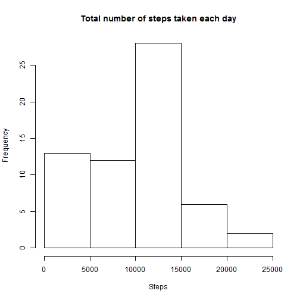
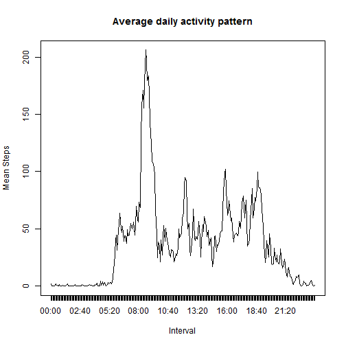
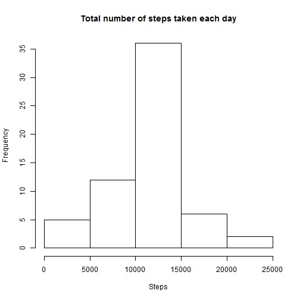
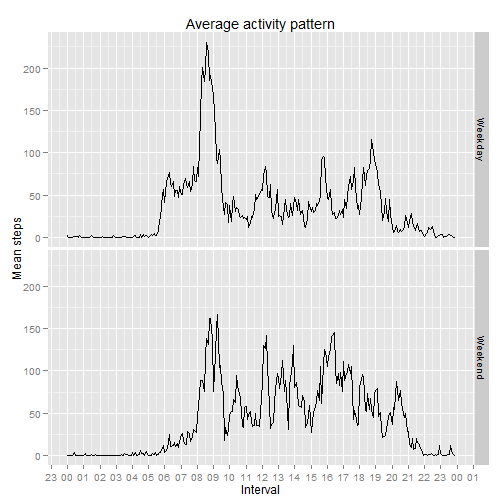

## Loading and preprocessing the data
Activity.csv contains data from a personal activity monitoring device. Data was collected at 5 minute intervals through out the day.  
This data is loaded for analysis.


```r
data <- read.csv("activity.csv")
```

Preprocessing of this data is done at every step when required.  

## What is mean total number of steps taken per day?
  
Data is grouped based on date. Sum of the steps taken on each day(date) is calculated ignoring the NAs.

```r
library(dplyr)
```

```r
steps_perday <- aggregate(steps ~ date, data=data, sum, na.rm=TRUE)
colnames(steps_perday) <- c("date", "total_steps")
```

Histogram of total number of steps taken each day is shown below.  

```r
hist(steps_perday$total_steps,
     xlab = "Steps",
     main = "Total number of steps taken each day")
```

 

```r
mean_steps <- mean(steps_perday$total_steps)
median_steps <- median(steps_perday$total_steps)
```

Mean total number of steps taken per day is **1.0766189 &times; 10<sup>4</sup>**.  Median is **10765**.  

## What is the average daily activity pattern?
'Interval' in the provided data is not in date/time format. It is processed by adding leading zeros to convert to time(POSIXct) format.  
Data is grouped based on interval.  Mean of the number of steps taken, averaged across all days is calculated ignoring NAs.  


```r
#add leading zeros
data$interval <- sprintf("%04d", data$interval)

#group and summarize data
data_byinterval <- group_by(data, interval)
summarized <- summarize(data_byinterval, mean(steps, na.rm = TRUE))
colnames(summarized) <- c("interval", "mean_steps")
```

Time series plot of the 5-minute interval (x-axis) and the average number of steps taken, averaged across all days (y-axis) shows the average daily activity pattern.  

```r
#convert interval to time format for plotting x axis
newinterval <- as.POSIXct(summarized$interval, format = "%H%M")

plot(newinterval, summarized$mean_steps, type = "l", xaxt = "n",
     xlab = "Interval", ylab = "Mean Steps", main = "Average daily activity pattern")
#plot x axis labels(time)
axis.POSIXct(1, at=newinterval)
```

 


```r
max <- summarized[summarized$mean_steps == max(summarized$mean_steps),]
max_interval <- strftime(as.POSIXct(max$interval, format = "%H%M"), format="%H:%M")
```
On average across all the days in the dataset, **08:35** interval contains the maximum number of steps.   

## Imputing missing values

```r
rowswithNAs <- sum(!complete.cases(data)) 
```
Total number of missing values in the dataset is 2304.    
**The mean for each 5-minute interval** is used for filling in all of the missing values in the dataset(assuming activity is similar during each corresponding intervals).   

```r
newdata <- merge(data, summarized, by.x = "interval", by.y = "interval")
for(i in 1:nrow(newdata)) {
     if(is.na(newdata[i,2])) {
             newdata[i,2] <- newdata[i,4]
     }   
     i <- i + 1
}
```

After filling in the missing values, data is grouped based on date. Sum of the steps taken on each day(date) is calculated.  


```r
newdata_bydate <- group_by(newdata, date)
newsteps_perday <- summarize(newdata_bydate, sum(steps))
colnames(newsteps_perday) <- c("date", "total_steps")
```
Histogram of the total number of steps taken each day is shown below.

```r
hist(newsteps_perday$total_steps,
     xlab = "Steps",
     main = "Total number of steps taken each day")
```

 

```r
newmean <- mean(newsteps_perday$total_steps)
newmedian <- median(newsteps_perday$total_steps)
```
According to the new dataset, mean total number of steps taken per day is 1.0766189 &times; 10<sup>4</sup> and the median is 1.0766189 &times; 10<sup>4</sup>. 
Mean remains the same and the median changed when compared to the dataset with NAs. Median is not same as the mean.

## Are there differences in activity patterns between weekdays and weekends?
A new column in added to the new dataset indicating if the day is a weekday or weekend day(With factor levels Weekend and Weekday).  

```r
newdata$day <- weekdays(as.Date(newdata$date))

for(i in 1:nrow(newdata)) {
        if(newdata[i,5] == "Sunday" | newdata[i,5] == "Saturday") {
                newdata[i,5] <- "Weekend"
        }
        else
                newdata[i,5] <- "Weekday"
        i <- i + 1
}
newdata$day <- as.factor(newdata$day)
```
The data is now grouped first by what day it is (Weekend/Weekday) and then by the interval.  Mean of the number of steps taken, averaged across all weekday days or weekend days is calculated.  

```r
grouped_data <- group_by(newdata, day, interval)
summarized_data <- summarize(grouped_data, mean(steps))
colnames(summarized_data) <- c("day", "interval", "mean_steps")
summarized_data$interval <- as.POSIXct(summarized_data$interval, format = "%H%M")
```
A panel plot containing a time series plot of the 5-minute interval (x-axis) and the average number of steps taken, averaged across all weekday days or weekend days (y-axis) is shown below.

```r
library(ggplot2)
library(scales)

g <- ggplot(summarized_data, aes(interval, mean_steps, width = 640))
g  + geom_line(aes(group = day)) +
        scale_x_datetime(labels = date_format("%H"),breaks = "1 hour") +
        facet_grid(day ~ .) +
        labs(y = "Mean steps") +
        labs(x = "Interval") +
        labs(title = "Average activity pattern")
```

 

This plot shows that there is difference in the activity patterns between weekdays and weekends.  Mean total number of steps around 5:00 to 10:00 a.m is higher on weekdays and in other times its slightly higher in weekends.
